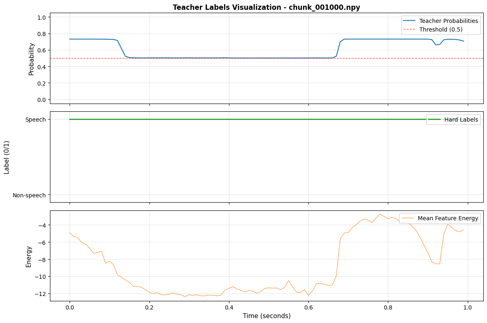

# Tiny VAD (Distilled)

Tiny VAD is a small frame-level voice activity detector distilled from Silero-VAD.  
It turns arbitrary audio into 10 ms speech probabilities using log-mel FBANKs, overlapping chunks, and a compact CNN + BiLSTM student.

## Technical highlights

- Format-agnostic audio loader (`wav`, `flac`, `opus`, `mp3`, `m4a`, `ogg`) with ffmpeg fallback.
- Kaldi-style log-mel FBANK features `compute_log_mel` (25 ms window, 10 ms hop, 80 bins).
- Teacher–student distillation from Silero frame probabilities to a lightweight student.
- Overlapping chunk merge (`reassemble_chunk_predictions`) for frame-level reconstruction.
- DataLoader tuned for Windows + GPU with configurable workers, prefetch, and pinning.
- ONNX export + notebooks for quick inspection and demos.

## Model structure (student)

- Input: chunks shaped `(batch, 100, 80)` (time × mel).  
- Backbone: 3× dilated 1-D convolutions (kernel 5, dilations 1/2/4) with ReLU + dropout.  
- Temporal context: 1-layer bidirectional LSTM (hidden size 64).  
- Head: linear layer to logits, then `sigmoid` → per-frame speech probability.

## Pipeline overview

1. Load audio (`load_audio`) → mono float32 at 16 kHz.  
2. Compute log-mel (`compute_log_mel`).  
3. Chunk to overlapping windows (`chunk_fbank_features` / `create_chunk_dataset`).  
4. Run Silero teacher to get `teacher_probs`.  
5. Train TinyVAD on chunks with MSE loss.  
6. At inference, run student on chunks and merge outputs (`reassemble_chunk_predictions`).  

## Training

1. Install dependencies:

```bash
python -m venv .venv
.venv\Scripts\activate  # on Windows
pip install -r requirements.txt
```

2. Point `vad_distill/config/default_config.yaml` at your data root (`paths.*`).  
3. Ensure chunks are prepared (see pipeline or `run_preprocessing_pipeline.py`).  
4. Run training:

```bash
python -m vad_distill.tiny_vad.train --config vad_distill/config/default_config.yaml
```

This produces checkpoints under `outputs/checkpoints` (e.g., `best.pt`).

## Inference

### CLI: one WAV file

```bash
python -m vad_distill.scripts.test_single_wav \
  path/to/audio.wav \
  outputs/checkpoints/best.pt \
  --config vad_distill/config/default_config.yaml
```

This saves smoothed scores (`*_scores.npy`) and speech segments (`*_segments.json`), and prints a short JSON summary.

### Notebook demos

- `notebooks/data_preprocessing.ipynb`: end-to-end pipeline from raw audio to chunks and teacher labels.  
- `notebooks/train_tiny_vad.ipynb`: short training run with loss curves and best checkpoint inspection.  
- `notebooks/inspect_best_student.ipynb`: compare teacher vs student probabilities over a full utterance.  
- `notebooks/inference_demo.ipynb`: run the exported ONNX model on a clip and plot student probabilities.

## Visual examples

Snapshots from the notebooks:

- Data preprocessing pipeline (`data_preprocessing.ipynb`):

  

- Training loss curves (`train_tiny_vad.ipynb`):

  

- Teacher vs student alignment (`inspect_best_student.ipynb`):

  

## Export (TorchScript / ONNX)

### TorchScript (local example)

```python
import torch
from vad_distill.tiny_vad.model import build_tiny_vad_model
from vad_distill.config import load_config

config = load_config("vad_distill/config/default_config.yaml")
model = build_tiny_vad_model(config)
state = torch.load("outputs/checkpoints/best.pt", map_location="cpu")
model.load_state_dict(state["model_state_dict"])
model.eval()

dummy = torch.randn(1, 100, config["model"]["n_mels"])
traced = torch.jit.trace(model, dummy)
traced.save("outputs/export/tiny_vad_ts.pt")
```

### ONNX (script)

```bash
python -m vad_distill.tiny_vad.export_onxx \
  --config vad_distill/config/default_config.yaml
```

The ONNX graph is written to `outputs/export/tiny_vad.onnx` by default and can be loaded with `onnxruntime`.

## Minimal Python wrapper

```python
from pathlib import Path

import numpy as np
import torch

from vad_distill.config import load_config
from vad_distill.config.chunk_config import N_MELS
from vad_distill.preprocessing.audio_utils import compute_log_mel, load_audio
from vad_distill.preprocessing.chunking import (
    chunk_fbank_features,
    reassemble_chunk_predictions,
)
from vad_distill.tiny_vad.model import build_tiny_vad_model


class TinyVAD:
    def __init__(self, checkpoint: str, config_path: str | None = None) -> None:
        self.config = load_config(config_path)
        self.device = torch.device("cuda" if torch.cuda.is_available() else "cpu")
        self.model = build_tiny_vad_model(self.config).to(self.device)
        state = torch.load(checkpoint, map_location=self.device)
        self.model.load_state_dict(state["model_state_dict"])
        self.model.eval()

    def from_wav(self, path: str) -> np.ndarray:
        wav = load_audio(path)
        fbank = compute_log_mel(wav, n_mels=N_MELS)
        chunks = chunk_fbank_features(fbank, pad_incomplete=True)
        preds = []
        with torch.no_grad():
            for _, chunk in chunks:
                x = torch.from_numpy(chunk).unsqueeze(0).to(self.device)
                logits = self.model(x)
                preds.append(torch.sigmoid(logits).cpu().numpy()[0])
        return reassemble_chunk_predictions(chunks, preds)


if __name__ == "__main__":
    vad = TinyVAD("outputs/checkpoints/best.pt", "vad_distill/config/default_config.yaml")
    scores = vad.from_wav("path/to/audio.wav")
    print(scores[:20])
```

## Project structure (short)

```text
notebooks/                     # Visual, low-friction entry points
  data_preprocessing.ipynb     # Raw audio → FBANK → chunks → teacher labels
  train_tiny_vad.ipynb         # Train TinyVAD on preprocessed chunks
  inspect_best_student.ipynb   # Teacher vs student alignment on full audio
  inference_demo.ipynb         # ONNX model demo and plots

vad_distill/
  config/
    default_config.yaml        # Paths, training, model hyperparameters
    chunk_config.py            # Shared frame/chunk sizes and sample rate
    data_paths.py              # Path resolution and directory helpers
  preprocessing/
    audio_utils.py             # Audio loading, resampling, log-mel FBANK
    chunking.py                # Chunk creation, metadata, reassembly
    run_preprocessing_pipeline.py  # End-to-end preprocessing CLI
  teacher/
    teacher_silero.py          # Silero loader + frame-level probability API
    frame_level_teacher.py     # Numpy-friendly wrapper used by pipeline
    generate_teacher_labels.py # Optional offline teacher labelling script
  tiny_vad/
    model.py                   # TinyVADModel definition and builder
    dataset.py                 # Chunk dataset + DataLoader helpers
    train.py                   # CLI training loop and checkpointing
    eval.py                    # Validation metrics over held-out chunks
    export_onxx.py             # Export TinyVAD to ONNX
  scripts/
    test_single_wav.py         # Run PyTorch/ONNX model on one audio file
    visualize_vad.py           # Waveform + FBANK + VAD score visualization

requirements.txt               # Core Python dependencies
pyproject.toml                 # Build + tooling configuration
```

## Future work

- Move to logit-based or temperature-scaled distillation.  
- Add a streaming inference pipeline with stateful convolutions.  
- Batch-prefetch decoding and feature extraction for lower latency.  
- Train on multiple VAD datasets with simple domain weighting.  
- Explore TCN / conformer variants as student backbones.  
- Provide a minimal “lite” ONNX export and quantization recipe.
