# PROJECT_REPORT.md

## SECTION 1 — Architecture Overview

### Pipeline Summary
1. **Raw audio ingestion** — Files located via `config.paths` are decoded by `vad_distill.preprocessing.audio_utils.load_audio`, which normalizes gain, mixes channels to mono, and resamples to 16 kHz using torchaudio.
2. **Feature extraction** — `compute_log_mel` produces Kaldi-style log-mel FBANK matrices that keep per-frame timing (25 ms window, 10 ms hop, 80 bins).
3. **Chunking** — `chunk_fbank_features` and `create_chunk_dataset` cut features into overlapping 100×80 chunks with 50-frame stride while pairing each frame with teacher probabilities.
4. **Teacher supervision** — `vad_distill.teacher.FrameLevelTeacher` wraps Silero VAD to emit soft labels (`teacher_probs`) and persist them under `teacher_prob_dir`.
5. **Student training** — `TinyVADChunkDataset`, `build_dataloader`, and `train_epoch` stream chunk tensors to the CNN + BiLSTM student defined in `TinyVADModel`.
6. **Inference** — `scripts/test_single_wav.run_inference` or ONNX runtimes reuse the same chunker; logits are sigmoid-activated and merged back to frame-level scores via `reassemble_chunk_predictions`.
7. **Post-processing** — Optional smoothing, thresholding, and JSON/NumPy exports feed notebooks and visualization scripts.

### Module Boundaries
- `vad_distill/preprocessing`: audio decoding (`audio_utils`), FBANK creation, chunk slicing/metadata management.
- `vad_distill/teacher`: Silero teacher loading (`teacher_silero`), frame-level inference, and offline probability caching.
- `vad_distill/tiny_vad`: dataset + dataloader builders, student model definition, training loop, evaluation, and ONNX export.
- `vad_distill/scripts`: CLI entry points for preprocessing, single-file inference, and visualization.
- `notebooks`: investigative and demo workflows (training sandbox, teacher/student inspection, ONNX inference).
- `vad_distill/config`: YAML loader, path resolver, and shared constants (`chunk_config`, `data_paths`).

### Textual Architecture Diagram

```mermaid
flowchart LR
    RAW["Raw audio (any format)"] --> LA["load_audio()"]
    LA --> MEL["compute_log_mel()"]
    MEL --> CHUNK["chunk_fbank_features() / create_chunk_dataset()"]
    CHUNK --> TEACHER["FrameLevelTeacher (Silero)"]
    TEACHER --> DATA["TinyVADChunkDataset + DataLoader"]
    DATA --> TRAIN["train_epoch() / evaluate()"]
    TRAIN --> CKPT["Checkpoints + ONNX export"]
    CKPT --> INFER["run_inference() / ONNX runtime"]
    INFER --> MERGE["reassemble_chunk_predictions()"]
```

## SECTION 2 — Technical Notes (Deep Dive)
- **Audio format–agnostic loader.** `load_audio` relies on torchaudio backends to autodetect WAV, FLAC, OPUS, MP3, M4A, and OGG; any failure automatically triggers a deterministic ffmpeg fallback so file type differences never leak into the pipeline. The loader enforces mono float32 output and resamples via high-quality sinc interpolation to guarantee consistent FBANK statistics.
- **Kaldi-style log-mel FBANK.** `compute_log_mel` wraps `torchaudio.compliance.kaldi.fbank`, so inputs match Kaldi’s framing and dithering defaults (disabled noise, 25 ms window, 10 ms hop, energy floor). This ensures the distilled student aligns numerically with well-known ASR feature conventions and makes exported ONNX models reproducible across toolchains.
- **Teacher-student soft VAD distillation.** `FrameLevelTeacher` provides Silero probabilities at 10 ms resolution, and `create_chunk_dataset` stores both `teacher_probs` and `hard_labels` so regression targets stay continuous while fallbacks exist for binary training. The training loop applies MSE between student sigmoid outputs and teacher scores, enabling smoother convergence than thresholded supervision.
- **TinyVAD CNN + LSTM topology.** `TinyVADModel` stacks three dilated 1-D convolutions (kernel 5, dilation 1/2/4) before a bidirectional LSTM (hidden size 64) and a linear head, striking a balance between local spectral modeling and temporal context. This design keeps the parameter count in the low millions, fits mobile deployment budgets, yet learns long-range speech activity cues.
- **Overlapping chunk merge algorithm.** `reassemble_chunk_predictions` performs frame-wise averaging with visit counts, preventing boundary artifacts when overlapping 100-frame windows with 50-frame stride. The averaging is vectorized in NumPy, producing deterministic reconstruction identical to training-time coverage.
- **PyTorch DataLoader strategy.** `build_dataloader` exposes `num_workers`, `prefetch_factor`, `pin_memory`, and `persistent_workers`, and can swap in subset samplers for curriculum-style epochs. The defaults target Windows+CUDA constraints (moderate workers, pinned batches) while still enabling large-batch shuffling without exhausting RAM.
- **FFmpeg fallback decoding.** When torchaudio backends fail or a codec is unsupported, `_ffmpeg_decode` emits mono float32 samples through a subprocess pipe without touching disk. This avoids shipping extra Python codecs and keeps OPUS/MP3 inputs first-class citizens even on minimal installations.
- **Windows + GPU multi-worker considerations.** Because PyTorch uses the `spawn` context on Windows, `build_dataloader` toggles `persistent_workers` only when `num_workers > 0` to avoid orphaned worker pools, and `pin_memory` defaults to `torch.cuda.is_available()` to minimize page-locked copies on CPU-only machines. Practitioners running many workers should keep dataset directories on SSDs to prevent handle exhaustion.
- **Streaming-friendly chunk architecture.** `chunk_fbank_features` can pad incomplete windows, and inference paths process each chunk independently before reassembly, so streaming decoders can emit new probabilities every 0.5 s without reprocessing prior context. The same chunk metadata (`frame_start`, `frame_end`) supports frame-level reconstruction for offline notebooks and online sliding windows alike.

## SECTION 3 — Efficiency Audit (Engineering Inspection)

### High Impact Issues
1. **Duplicate audio decode in preprocessing**
   - *File*: `vad_distill/preprocessing/run_preprocessing_pipeline.py` + `vad_distill/teacher/frame_level_teacher.py`
   - *Cause*: The pipeline loads each waveform once for FBANK creation and then calls `FrameLevelTeacher.get_frame_probs`, which in turn calls `load_audio` again from disk instead of reusing the already decoded array.
   - *Impact*: Every file is decoded twice, doubling I/O and CPU time for large corpora (e.g., 1.5 M chunks ≈ multiple hours of redundant decoding) and increasing ffmpeg subprocess utilization unnecessarily.
   - *Minimal patch*: Change `ensure_teacher_probs` to accept the preloaded waveform (and sample rate) and pass it to `FrameLevelTeacher._infer_from_array`, bypassing the second `load_audio` call while retaining on-disk caching behavior.

2. **Pickled chunk storage throttles the DataLoader**
   - *File*: `vad_distill/preprocessing/chunking.py` (`create_chunk_dataset`)
   - *Cause*: Each chunk is serialized via `np.save(..., allow_pickle=True)` containing a Python dict with NumPy arrays. Training then executes `np.load(...).item()`, forcing Python-level unpickling for every sample and prohibiting memory mapping or vectorized reads.
   - *Impact*: Millions of small pickle loads dominate training latency, keep the GIL hot, and block DataLoader workers even with high `num_workers`, leading to underutilized GPUs.
   - *Minimal patch*: Switch to `np.savez_compressed` or custom `.npy` layouts that store raw float arrays without pickles (e.g., concatenate features and labels, plus metadata JSON) so workers can use `np.load(..., mmap_mode="r")` and avoid per-sample Python objects.

### Medium Impact Issues
1. **Metadata accumulation scales poorly**
   - *File*: `vad_distill/preprocessing/run_preprocessing_pipeline.py`
   - *Cause*: The pipeline appends every chunk’s metadata dict to a Python list before writing `index.json` at the end, so memory grows linearly with chunk count.
   - *Impact*: Processing multi-million chunk corpora can consume hundreds of megabytes of RAM and risks `MemoryError` on smaller machines.
   - *Minimal patch*: Stream metadata to disk (e.g., write NDJSON incrementally or flush batches) instead of keeping the entire list in memory.

2. **Notebook rebuilds datasets twice per run**
   - *File*: `notebooks/train_tiny_vad.ipynb`
   - *Cause*: The notebook calls `build_datasets` to print sizes and later invokes `run_training`, which internally calls `build_datasets` again, re-globbing millions of chunk files.
   - *Impact*: Each interactive run performs two expensive directory scans and subset splits, which on HDD-based datasets adds several minutes of overhead before training actually starts.
   - *Minimal patch*: Reuse the already constructed `train_subset`/`val_subset` by passing them (or their paths) into `run_training`, or avoid the pre-run size probe entirely.

3. **Sequential numpy↔torch conversions in single-file inference**
   - *File*: `vad_distill/scripts/test_single_wav.py`
   - *Cause*: `run_inference` iterates over chunks, converting each NumPy chunk to a torch tensor, running the model, and immediately converting back, resulting in thousands of tiny host-to-device transfers.
   - *Impact*: GPU execution is serialization-bound and cannot amortize kernel launches, so inference on long recordings becomes CPU limited.
   - *Minimal patch*: Stack chunks into a single `(num_chunks, 100, 80)` tensor (or mini-batches) and perform a batched forward pass, reducing transfers to one copy and letting cuDNN vectorize the convolutions.

4. **Teacher recomputation in inspection notebook**
   - *File*: `notebooks/inspect_best_student.ipynb`
   - *Cause*: `run_teacher_on_full_audio` instantiates `FrameLevelTeacher` and runs Silero on the full waveform every time the cell is executed, even if cached `teacher_prob_dir` arrays already exist.
   - *Impact*: Re-running the notebook repeatedly reprocesses the teacher network (tens of seconds on GPU, minutes on CPU) and defeats the purpose of precomputed labels.
   - *Minimal patch*: Load precomputed `.npy` files when available and only fall back to live teacher inference when the cache misses.

5. **Hard-coded chunk shape in model.forward**
   - *File*: `vad_distill/tiny_vad/model.py`
   - *Cause*: `TinyVADModel.forward` raises if input tensors are not exactly `(batch, 100, 80)`, so changing `chunk_config.CHUNK_SIZE` or `N_MELS` in YAML silently breaks training/inference.
   - *Impact*: The configuration system cannot actually tune chunk or feature dimensions, hurting extensibility (e.g., wider mel banks for noise-robustness).
   - *Minimal patch*: Store `chunk_size`/`n_mels` as constructor parameters and validate against those attributes instead of fixed literals.

### Low Impact Issues
1. **Redundant chunk merging implementation**
   - *File*: `notebooks/inspect_best_student.ipynb`
   - *Cause*: `run_student_chunks` reimplements overlap-add logic with manual accumulation even though `reassemble_chunk_predictions` already solves the same problem.
   - *Impact*: Two code paths for merging can drift, and the notebook currently recomputes chunk padding and averaging on the GPU, duplicating work and maintenance burden.
   - *Minimal patch*: Use `chunk_fbank_features` + `reassemble_chunk_predictions` in the notebook to stay aligned with production inference.

2. **Double normalization during inference notebooks**
   - *File*: `notebooks/inspect_best_student.ipynb`
   - *Cause*: `extract_normalized_mel` standardizes mel features, but `TinyVADModel.forward` also performs per-chunk mean/variance normalization, effectively normalizing twice.
   - *Impact*: Notebook visualizations can deviate slightly from training behavior and add unnecessary compute on long clips.
   - *Minimal patch*: Skip the manual normalization before feeding tensors into the model in notebook contexts.

3. **Static PATHS cache vs runtime resolves**
   - *File*: `vad_distill/config/data_paths.py`
   - *Cause*: The module-level `PATHS` snapshot is captured at import time and never refreshed, while other modules call `resolve_paths` dynamically, resulting in two sources of truth.
   - *Impact*: Scripts relying on `PATHS` (e.g., notebooks that import `RAW_DIR`) ignore CLI overrides or alternate configs, causing subtle path mismatches.
   - *Minimal patch*: Remove the global cache or refresh it when `load_config` is called with overrides so every consumer sees coherent paths.

4. **Naming inconsistency (`export_onxx.py`)**
   - *File*: `vad_distill/tiny_vad/export_onxx.py`
   - *Cause*: The filename and module export use “onxx” rather than “onnx”.
   - *Impact*: IDE search and shell autocompletion often miss the file, and contributors can mistakenly create a second correctly named script.
   - *Minimal patch*: Rename the file and update imports/CLI references to `export_onnx.py`.

## SECTION 4 — Change History (Summary Only)
- Removed the legacy WAV/OPUS directory split by centralizing decoding in `load_audio`, so every tool now handles arbitrary codecs uniformly.
- Added the format-agnostic `load_audio` + Kaldi FBANK helpers, eliminating bespoke Librosa pipelines.
- Fixed tail-frame loss during dataset creation by zero-padding incomplete chunks and storing exact `frame_start`/`frame_end` metadata.
- Simplified notebooks to drive training via `run_training(config)` instead of ad-hoc loops, keeping them in sync with the CLI.
- Consolidated path handling into `config.data_paths`, enabling one YAML file to steer preprocessing, training, ONNX export, and notebooks.
- Exported the TinyVAD student to ONNX and provided `scripts/test_single_wav.py` plus `notebooks/inference_demo.ipynb` for deterministic inference demos.

## SECTION 5 — API Reference (Concise)
- `load_audio(path, target_sr)`: Reads any supported audio file, resamples to `target_sr`, and returns a mono float32 NumPy waveform.
- `compute_log_mel(wav, sample_rate, n_mels, frame_len, frame_hop)`: Converts a mono waveform into a `(T, n_mels)` Kaldi-style log-mel matrix.
- `create_chunk_dataset(uid, fbank, teacher_probs, output_dir, start_chunk_id)`: Writes overlapping chunk payloads (features + soft labels) to disk and returns updated chunk_id plus metadata.
- `FrameLevelTeacher.get_frame_probs(wav_path)`: Loads a waveform, runs Silero VAD, and returns per-frame speech probabilities as float32 NumPy data.
- `scripts.test_single_wav.run_inference(wav_path, model_path, config_path, use_onnx)`: Runs TinyVAD (PyTorch or ONNX) over one file and emits frame-level probabilities.
- `reassemble_chunk_predictions(chunks, predictions, chunk_size)`: Averages overlapping chunk predictions to reconstruct a contiguous per-frame probability vector.
- `build_datasets(config, seed, paths)`: Constructs training/validation `Subset` objects backed by `TinyVADChunkDataset` according to YAML limits and splits.
- `build_dataloader(dataset, training_cfg, shuffle, sampler=None)`: Creates a PyTorch `DataLoader` with tuned worker, pinning, and prefetch settings for the given dataset.
- `train_epoch(model, loader, optimizer, device, max_grad_norm, log_interval, epoch)`: Performs one supervised epoch, returning average loss and gradient norm.
- `evaluate(model, loader, device)`: Runs the student in eval mode over a validation loader and returns the mean MSE versus teacher probabilities.
- `TinyVADModel.forward(batch)`: Accepts a `(batch, chunk_size, n_mels)` tensor, applies CNN+BiLSTM layers, and outputs frame-level logits ready for sigmoid.

## SECTION 6 — Future Work
- Logit-based or temperature-scaled distillation to let the student match teacher uncertainty without MSE saturation.
- Low-latency streaming inference pipeline that keeps convolutional states across windows instead of recomputing overlapping frames.
- Batch-prefetch decoding that decodes audio to FBANKs asynchronously before training/inference requests arrive.
- Multi-dataset VAD training with dataset-specific weighting or domain adapters to improve robustness.
- Investigate CNN/TCN or conformer-style replacements for the BiLSTM block to reduce sequential latency.
- Provide an officially supported ONNX Lite / CoreML export path plus calibration scripts for integer quantization.

